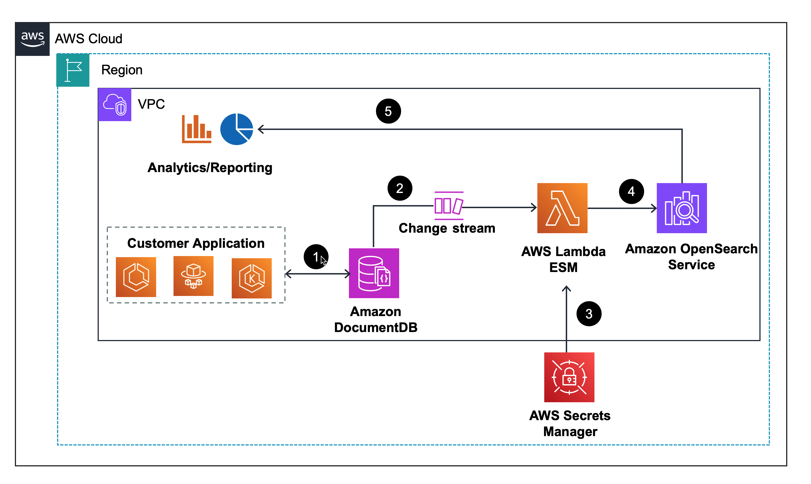

# Guidance for Integrated scalable search for Amazon DocumentDB with Amazon OpenSearch


## Table of Content 

1. [Overview](#Overview)
    - [Cost](#cost)
2. [Prerequisites](#prerequisites-required)
    - [Operating System](#operating-system-required)
3. [Deployment Steps](#deployment-steps-required)
4. [Deployment Validation](#deployment-validation-required)
5. [Running the Guidance](#running-the-guidance-required)
6. [Next Steps](#next-steps-required)
7. [Cleanup](#cleanup-required)
8. [Authors](#authors-optional)

## Overview


Amazon DocumentDB provides native text search and vector search capabilities. With Amazon OpenSearch Service you can run advance search and analytics  such as fuzzy search, synonym search, cross-collection search, and multilingual search on Amazon DocumentDB data. 

This guidance demonstrates way to run advance search and analytics on Amazon DocumentDB data using Amazon OpenSearch Service.



1. The application reads data from and writes to Amazon DocumentDB.
2. AWS Lambda Event Source Mapping (ESM) gets invoked in near real-time with the inserts and updates recorded Amazon DocumentDB change streams. Amazon DocumentDB change streams provide a time-ordered sequence of change events that occur within your collections.
3. AWS Lambda fetches credentials from AWS Secrets Manager to read from Amazon DocumentDB change streams. 
4. AWS Lambda streams the updates from Amazon DocumentDB change streams to the Amazon OpenSearch Service in near real-time.
5. Analytics or reporting tools fetch the data from the Amazon OpenSearch service for reporting. 


### Cost 

_You are responsible for the cost of the AWS services used while running this Guidance. As of June 2024, the cost for running this Guidance with the default settings in the US East (N. Virginia) region is approximately $1410.36 per month with below configuration._

_We recommend creating a [Budget](https://docs.aws.amazon.com/cost-management/latest/userguide/budgets-managing-costs.html) through [AWS Cost Explorer](https://aws.amazon.com/aws-cost-management/aws-cost-explorer/) to help manage costs. Prices are subject to change. For full details, refer to the pricing webpage for each AWS service used in this Guidance._

The following table provides a sample cost breakdown for deploying this Guidance with the default parameters in the US East (N. Virginia) Region for one month.

| AWS service  | Dimensions | Cost [USD/month] |
| ----------- | ------------ | ------------ |
| Amazon DocumentDB Instance Based Cluster | Standard Cluster Configuration, 3 X Instance type (db.r6g.large), Storage (100 GB), I/Os (100 millions), Backup 1 Day | $606.30 |
| Amazon OpenSearch Service Serverless | 2 Indexing OSUs, 2 Search and Query OCUs, 20 GB index data | $701.28 |
| AWS Lambda | Invoke Mode (Buffered), Architecture (x86), 15 million requests/month, 512 MB ephemeral storage | $27.38 |
| AWS Secrets Manager | 1 Secret, 15 million requests/month | $75.40 |
## Prerequisites 

1. Install and configure the latest version of the [AWS CLI (2.2.37 or newer)](https://aws.amazon.com/cli/) on the compute instance you are going to use to interact with. This can be your personal laptop, an Amazon EC2 instance, Cloud9, or similar. 
2.  To deploy this guidance, ensure that the user has permissions to create, list, and modify resources 
   - A VPC and the required networking components
   - Amazon DocumentDB
   - Amazon OpenSearch
   - AWS Lambda
   - An AWS Cloud9 environment 
   - AWS Secrets Manager
   - AWS Cloud9

### Operating System 

“These deployment instructions are optimized to best work on Amazon Linux 2 AMI or Mac OS.  Deployment in another OS may require additional steps.”

## Deployment Steps

The cloudformation stack can be easily deployed using AWS Console or using AWS CLI and here are the steps for both.

### Using AWS Console
Below are the steps to deploy the Cloudformation temolate using the AWS Console
1. Download the [docdb_change_streams_amazon_os.yml](https://github.com/aws-solutions-library-samples/guidance-for-integrated-scalable-search-for-amazon-documentdb-with-amazon-opensearch/blob/main/deployment/docdb_change_streams_amazon_os.yml)
2. Navigate to AWS CloudFormation service on your AWS Console
3. Choose ***Create stack*** and select **with new resources (standard)**
4. On **Specify template** choose ***Upload a template file***
5. Enter the **Stack name** for your CloudFormation stack.
6. For **DocDBIdentifier**, enter a name of your Amazon DocumentDB cluster that will be created.
7. For **DocDBPassword**, enter the administrator password for your Amazon DocumentDB cluster (minimum 8 characters).
8. For **DocDBUsername**, enter the name of your administrator user in the Amazon DocumentDB cluster.
9. For **ExistingCloud9Role**, choose **True** ***only when you have the AWS Identity and Access Management (IAM) role AWSCloud9SSMAccessRole*** created in your account.
    - If you have used AWS Cloud9 before, you should already have an existing role. You can verify by going to the IAM console and searching for it on the Roles page. Stack creation will fail if the roles exists and you choose False.
10. Choose **Next**.
11. Select the check box in the **Capabilities** section to allow the stack to create an IAM role, then choose **Submit**.

### Using AWS CLI

1. Clone the repo using command
 
   ```gh repo clone aws-solutions-library-samples/guidance-for-integrated-scalable-search-for-amazon-documentdb-with-amazon-opensearch```
   
3. Change directory  to the deplpoyment folder

   ```cd guidance-for-integrated-scalable-search-for-amazon-documentdb-with-amazon-opensearch/deployment```
   
4. Create the stack, here is an example command to deploy the stack
   
``` aws cloudformation create-stack --template-body file://docdb_change_streams_amazon_os.yml --stack-name <StackName> --parameters ParameterKey=DocDBIdentifier,ParameterValue=<DocmentDB_Identifier> ParameterKey=DocDBPassword,ParameterValue=<DocumentDB_Password> ParameterKey=DocDBUsername,ParameterValue=<DocumentDB_Username> ParameterKey=ExistingCloud9Role,ParameterValue=<true or false> --capabilities <CAPABILITY_NAMED_IAM> ``` 

## Deployment Validation  

Deployment validation can be done using AWS Console or AWS CLI

### Using AWS Console

1. Open CloudFormation console and verify the status of the template with your stack name provided earlier. The stack creation status should be **CREATE_COMPLETE**
2. You will also find another linked stack that gets created for AWS Cloud9 starting with the stack name prefixed with ```aws-cloud9-ChangeStreamsCloud9-```
3. If your deployment is sucessful, you should see an active Amazon DocumentDB cluster with the cluster name provided in the previous steps

### Using AWS CLI

* Open CloudFormation console and verify the status of the template with the name starting with xxxxxx.
* If deployment is successful, you should see an active database instance with the name starting in Amazon DocumentDB console.
* Run the following CLI command to validate the deployment: ```aws cloudformation describe xxxxxxxxxxxxx```


## Running the Guidance (required)

### Set up an AWS Cloud9 environment

1. Navigate to the AWS Cloud9 console, Select **Open** for **ChangeStreamsCloud9** environment.

    **Note**: If you have launched the infrastructure using the CLI depending upon your premission setup you may need to add provide access, following commands can be helpful.

   i. List the cloud9 environments

   ```aws cloud9 list-environments```

   ii. If you have multiple cloud9 environments, you can use the following command to identify the applicable one
   
   ```aws cloud9 describe-environment-memberships --environment-id <environmentID> ``` 

   iii. Add your AWS console user/role to the environment

   ``` aws cloud9 create-environment-membership --environment-id <environmentID> --user-arn <AWSConsoleUserARN> --permissions read-write ```
   
3. Launch a new terminal window by choosing Window and New Terminal.
4. Install the required packages by running the following script to connect to Amazon DocumentDB using a terminal and load the reviews dataset using a Python script:

```
# Setting up mongo 4.0 repo

echo -e "[mongodb-org-4.0] \nname=MongoDB Repository\nbaseurl=https://repo.mongodb.org/yum/amazon/2013.03/mongodb-org/4.0/x86_64/\ngpgcheck=1 \nenabled=1 \ngpgkey=https://www.mongodb.org/static/pgp/server-4.0.asc" | sudo tee /etc/yum.repos.d/mongodb-org-4.0.repo

# Installing packages
sudo yum -y update
sudo yum -y install mongodb-org-shell
sudo python3 -m pip install --upgrade pip
sudo python3 -m pip install pandas pymongo

# Downloading the SSL file and the loader

wget https://truststore.pki.rds.amazonaws.com/global/global-bundle.pem
wget https://github.com/aws-solutions-library-samples/guidance-for-integrated-scalable-search-for-amazon-documentdb-with-amazon-opensearch/blob/main/assets/loader.py

```
### Enable Amazon DocumentDB change streams

For Amazon DocumentDB cluster details, navigate to Amazon DocumentDB console and locate your cluster.

1. On your AWS Cloud 9 terminal run the following commands, replacing the values with those of your cluster

```
export DOCDB_ENDPOINT=<Amazon DocumentDB Endpoint>
export USERNAME=<Amazon DocumentDB cluster username>
export PASSWORD=<Amazon DocumentDB cluster password>

echo "export DOCDB_ENDPOINT=${DOCDB_ENDPOINT}" >> ~/.bash_profile
echo "export USERNAME=${USERNAME}" >> ~/.bash_profile
echo "export PASSWORD=${PASSWORD}" >> ~/.bash_profile
```
2. Connect to Amazon DocumentDB:

``` mongo --ssl --host $DOCDB_ENDPOINT:27017 --sslCAFile global-bundle.pem --username $USERNAME --password $PASSWORD ```

3. Enable change streams on all databases and collections:
   
``` db.adminCommand({modifyChangeStreams: 1, database: "", collection: "", enable: true}) ```

### Configure the Amazon DocumentDB change stream as a source for the Lambda function

1. Navigate to Lambda console, navigate to the Lambda function named ```DocumentDBLambdaESM```.
2. On the Configuration tab, choose Triggers and choose Add trigger.
3. Select the source as Amazon DocumentDB for the trigger configuration.
4. For DocumentDB cluster, choose the cluster created by the CloudFormation stack.
5. For Database name, enter ```productreviewdb```.
6. For Collection name, enter ```productreviews```.
7. For Secrets Manager key, choose the Secrets Manager key created by the CloudFormation stack. You can find it in the CloudFormation stack outputs as the value for the key **DocDBSecretName**.
8. For **Batch window**, set it to the maximum amount of time in seconds to gather records before invoking your function. We set this to a low amount (5 seconds) to make the invocations happen faster.
9. For all other parameters, leave them at their defaults.
10. Choose **Add**.

### Load the reviews dataset into Amazon DocumentDB and search 

Navigate to AWS Cloud9, launch new terminal and execute the loader script
   ``` python3 loader.py```


### Setup OpenSearch on AWS Cloud9 terminal

1. From the Cloudfromation stack outputs, copy your Opensearch Sevice endpoint
2. On the AWS Cloud9 terminal run the 

```
export AOS_HOST=<Amazon OpenSearch Service Endpoint>
echo "export AOS_HOST=${AOS_HOST}" >> ~/.bash_profile
curl https://$AOS_HOST/_cat/indices/documentdb-reviews?v=true

```
You will see similar output:

```
health status index              uuid                   pri rep docs.count docs.deleted store.size pri.store.size
yellow open   documentdb-reviews HSI2-ih-QLa_PTYY-yDHng   5   1     102931         4354     81.9mb         81.9mb
```

## Run queries on Amazon DocumentDB data in OpenSearch Service

### Fuzzy search:

Fuzzy queries return documents that contain terms similar to the search term. For example, if the search term is "easy," documents with data matching "eays", "ease", "easi" and more are matched.

Here is query to find all reviews with a review body that has a fuzzy match for “easi”:
```
curl https://$AOS_HOST/documentdb-reviews/_search?pretty -H "Content-Type: application/json" -d \
'
{
    "query": {
        "fuzzy" : {
            "review_body" : {
                "value": "easi"
            }
        }
    }
}
'
```
Sample output:
```
{
  "took" : 62,
  "timed_out" : false,
  "_shards" : {
    "total" : 5,
    "successful" : 5,
    "skipped" : 0,
    "failed" : 0
  },
  "hits" : {
    "total" : {
      "value" : 10000,
      "relation" : "gte"
    },
    "max_score" : 3.0857868,
    "hits" : [
      {
        "_index" : "documentdb-reviews",
        "_id" : "64d5f4a20f98e701c42b5bae",
```


### Search with synonyms:

You can upload custom dictionary files such as stop words and synonyms referred to as packages to your Amazon OpenSearch cluster to tell OpenSearch to ignore certain high-frequency words or to treat terms like “brinjal”, “aubergine”, and “eggplant” as equivalent, resulting in better search results.

To implement search with synonyms, you need to perform additional configuration on your Amazon OpenSearch Service cluster. For steps to implement synonym search, see [custom packages for Amazon OpenSearch](https://aws.amazon.com/blogs/database/perform-fuzzy-full-text-search-and-semantic-search-on-amazon-documentdb-using-amazon-opensearch-service/#:~:text=custom%20packages%20for%20Amazon%20OpenSearch.) . 

The following is an example for synonym search that considers "software" and "program" equivalent in the review_body field.

```
curl https://$AOS_HOST/documentdb-reviews/_search?pretty -H "Content-Type: application/json" -d \
'
{
  "query": {
    "match": {
      "review_body": "software"
    }
  }
}
'
```

Sample output:
```
{
        "_index": "documentdb-reviews",
        "_id": "nqde34kB-h_19Z5f1Qml",
        "_score": 9.878886,
        "_source": {
          "customer_id": 326008690,
          "product_id": "P5STAPV6HU",
          "product_category": "Office Products",
          "review_id": "R75Y7F18631HQ",
          "helpful_votes": 4,
          "product_title": "RELIABLE TAX PROGRAM",
          "review_body": "RELIABLE TAX PROGRAM software helps you manage your taxes smoothly and efficiently with user-friendly features designed for tax prep novices and pros alike. This program simplifies the tax filing process.",
          "review_date": "2021-04-20",
          "star_rating": 5,
          "total_votes": 4,
          "verified_purchase": true,
          "helpful_votes#review_id": "04#R75Y7F18631HQ"
        }
      }

```

## Next Steps

You can explore with more custom packages for synonym search and using OpenSearch Service Dashboard to visualise data

## Cleanup 

### Using AWS CLI
1. Navigate to Cloudformation console, locate the stack with the name you provided while creating the stack
2. **Select** the stack and choose **Delete**

### Using AWS CLI
To delete the stack run the following command (replace the stack-name)

``` aws cloudformation delete-stack  --stack-name <StackName> ```

## Notices 

**Disclaimer: **
*Customers are responsible for making their own independent assessment of the information in this Guidance. This Guidance: (a) is for informational purposes only, (b) represents AWS current product offerings and practices, which are subject to change without notice, and (c) does not create any commitments or assurances from AWS and its affiliates, suppliers or licensors. AWS products or services are provided “as is” without warranties, representations, or conditions of any kind, whether express or implied. AWS responsibilities and liabilities to its customers are controlled by AWS agreements, and this Guidance is not part of, nor does it modify, any agreement between AWS and its customers.*


## Authors 

Anshu Vajpayee

Kaarthiik Thota
